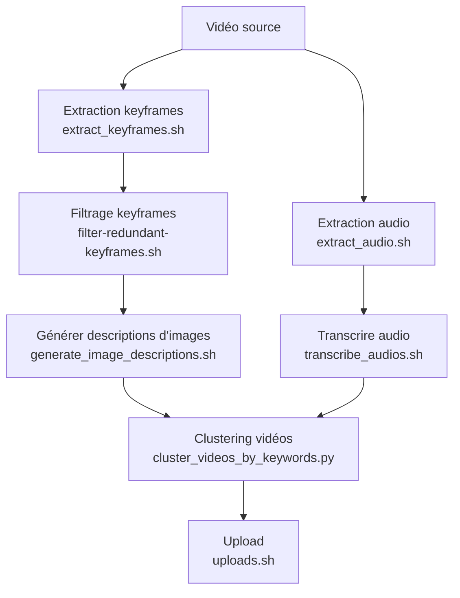

# Qu'est-ce que c'est ?

Ensemble de scripts pour générer des keyframes, filtrer les images, décrire les images, extraire et transcrire l'audio, organiser et uploader les vidéos.

## Implémentation

* ffmpeg : extraction de keyframes
* Scripts de filtrage : suppression des keyframes redondantes
* Scripts de description d'images : génération de descriptions à partir des images extraites
* [whisper](https://github.com/openai/whisper) : transcription audio
* Clustering : organisation des vidéos par similarité

## Utilisation

Un ensemble de scripts génère les fichiers de sortie, qui sont ensuite organisés et uploadés en lot.

```bash
MEDIADIR=/media/Videos
# Extraction des keyframes de chaque vidéo
./extract_keyframes.sh $MEDIADIR/*

# Filtrage des keyframes redondantes
./filter-redundant-keyframes.sh $MEDIADIR/*

# Génération de descriptions d'images à partir des keyframes filtrées
./generate_image_descriptions.sh $MEDIADIR/*keyframe*.jpg

# Extraction de l'audio de chaque vidéo
./extract_audio.sh $MEDIADIR/*

# Transcription de l'audio des vidéos
./transcribe_audios.sh $MEDIADIR/*

# Clustering des vidéos selon les descriptions ou transcriptions
python cluster_videos_by_keywords.py $MEDIADIR/*

# Upload des vidéos et métadonnées
./uploads.sh $MEDIADIR/*
```

## Liste des scripts principaux

- `extract_keyframes.sh` : Extrait les images clés (keyframes) de chaque vidéo.
- `filter-redundant-keyframes.sh` / `filter-redundant-keyframes.py` : Filtre et supprime les keyframes redondantes.
- `generate_image_descriptions.sh` / `generate_image_descriptions.py` / `generate_image_descriptions.md` : Génère une description textuelle pour chaque image extraite.
- `extract_audio.sh` : Extrait l'audio de chaque vidéo.
- `transcribe_audios.sh` : Transcrit l'audio de chaque vidéo en texte (utilise les fichiers audio extraits).
- `cluster_videos_by_keywords.py` : Regroupe les vidéos par similarité de mots-clés ou de contenu.
- `uploads.sh` / `upload.sh` : Upload les vidéos et leurs métadonnées.

## Diagramme du flux


