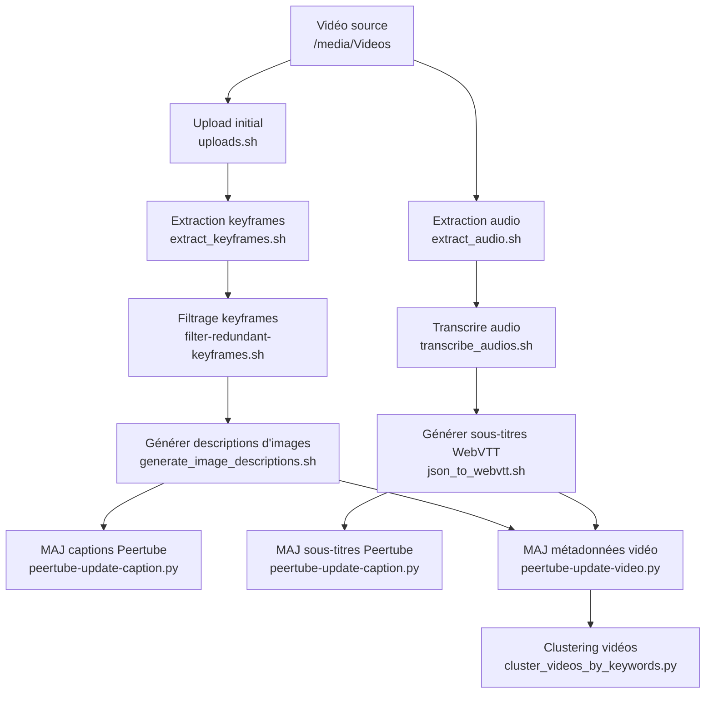

# Qu'est-ce que c'est ?
- Génération de keyframes à partir des vidéos
- Filtrage des images extraites pour supprimer les redondances
- Description automatique des images extraites
- Extraction et transcription de l'audio des vidéos
- Organisation des vidéos par similarité de contenu
- Upload des vidéos et de leurs métadonnées

## Présentations

* [Construire une pipeline de traitement vidéos](https://gist-reveal.it/e1342c5bf64b999999054e51c3bb7c9c#/)
* [utilisation de modèles d'intelligence artificielle en local](https://gist-reveal.it/180c31d5c649a46f66294cab32e9fbdb#/)
* [Découvrez l'auto-hébergement de votre contenu vidéo](https://rngadam.github.io/slideshows/d5aa8079b2ef234c2d2e09806907553dc7d000c227e28f394019a4dff4495194/index.html)

## Implémentation

* ffmpeg : extraction de keyframes
* Scripts de filtrage : suppression des keyframes redondantes
* Scripts de description d'images : génération de descriptions à partir des images extraites
* [whisper](https://github.com/openai/whisper) : transcription audio
* Clustering : organisation des vidéos par similarité

## Utilisation

Un ensemble de scripts génère les fichiers de sortie, qui sont ensuite organisés et uploadés en lot.

```bash
MEDIADIR=/media/Videos
# Upload initial des vidéos
./uploads.sh $MEDIADIR/*

# Extraction des keyframes de chaque vidéo
./extract_keyframes.sh $MEDIADIR/*

# Filtrage des keyframes redondantes
./filter-redundant-keyframes.sh $MEDIADIR/*

# Génération de descriptions d'images à partir des keyframes filtrées
./generate_image_descriptions.sh $MEDIADIR/*

# Mise à jour des captions sur Peertube
./peertube-update-caption.py $MEDIADIR/*

# Extraction de l'audio de chaque vidéo
./extract_audio.sh $MEDIADIR/*

# Transcription de l'audio des vidéos
./transcribe_audios.sh $MEDIADIR/*

# Génération de sous-titres WebVTT à partir des transcriptions
./json_to_webvtt.sh $MEDIADIR/*

# Mise à jour des sous-titres sur Peertube
./peertube-update-caption.py $MEDIADIR/*

# Clustering des vidéos selon les descriptions ou transcriptions
python cluster_videos_by_keywords.py $MEDIADIR/*

# Mise à jour des métadonnées vidéo sur Peertube
./peertube-update-video.py $MEDIADIR/*
```

## Liste des scripts principaux

- `extract_keyframes.sh` : Extrait les images clés (keyframes) de chaque vidéo.
- `filter-redundant-keyframes.sh` / `filter-redundant-keyframes.py` : Filtre et supprime les keyframes redondantes.
- `generate_image_descriptions.sh` / `generate_image_descriptions.py` / `generate_image_descriptions.md` : Génère une description textuelle pour chaque image extraite.
- `extract_audio.sh` : Extrait l'audio de chaque vidéo.
- `transcribe_audios.sh` : Transcrit l'audio de chaque vidéo en texte (utilise les fichiers audio extraits).
- `json_to_webvtt.sh` / `json_to_webvtt.py` : Convertit les transcriptions JSON en fichiers de sous-titres WebVTT.
- `uploads.sh` / `upload.sh` : Upload les vidéos et leurs métadonnées dès le début du pipeline.
- `peertube-update-caption.py` : Met à jour les légendes/captions sur Peertube à chaque étape.
- `peertube-update-video.py` : Met à jour les métadonnées (description, titre, etc.) sur Peertube à chaque étape.
- `cluster_videos_by_keywords.py` : Regroupe les vidéos par similarité de mots-clés ou de contenu.

## Diagramme du flux



## à faire

* réintégrer le développement itératif (mise à jour) en un seul script
* explorer l'intégration des fonctionnalités directement dans Peertube (gestion des jobs batch)
* MAJ à Peertube 7
  * https://github.com/Chocobozzz/PeerTube
    * [package](https://search.nixos.org/packages?channel=25.05&show=peertube&from=0&size=50&sort=relevance&type=packages&query=peertube) NixOS:
* s'assurer de garder l'identifiant au téléversement des vidéos
